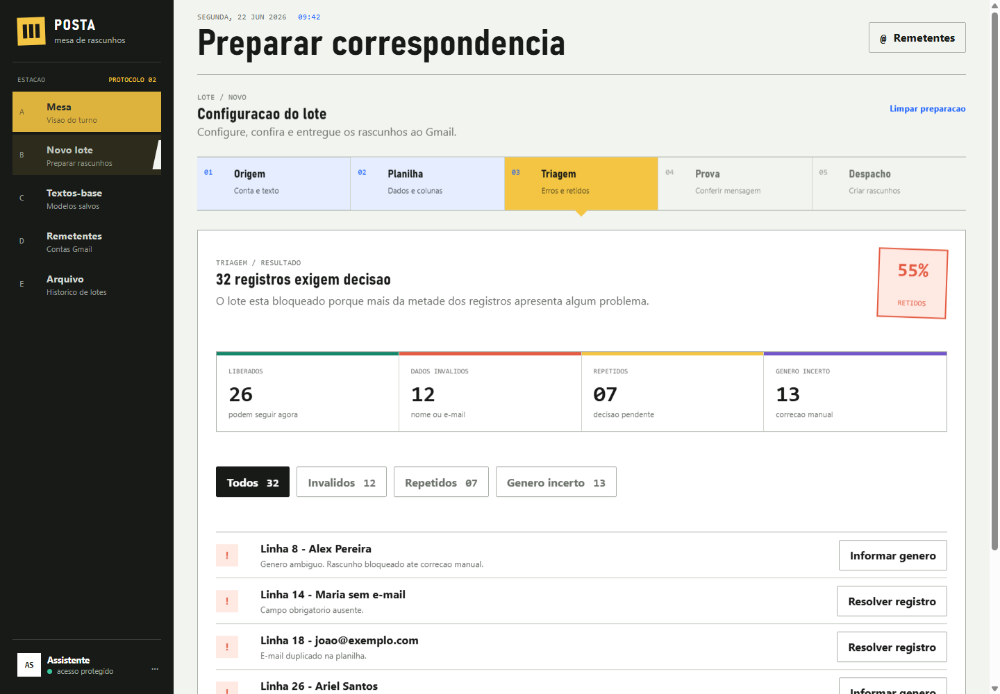

# EDS Prototype — POSTA

Protótipo navegável de uma mesa de preparação de rascunhos individualizados para Gmail. A aplicação demonstra o fluxo de importação, triagem, personalização, revisão e criação de rascunhos, mantendo o envio final sob revisão humana.



## Executar localmente

O protótipo usa somente HTML, CSS e JavaScript, sem etapa de build.

1. Clone o repositório.
2. Abra `index.html` em um navegador moderno.

Também é possível servir a pasta com qualquer servidor HTTP estático.

## Áreas demonstradas

- Mesa de despacho com indicadores, lotes recentes e monitor de processamento.
- Assistente de novo lote em cinco etapas.
- Configuração de remetente, texto-base e assunto.
- Seleção de planilha, aba e mapeamento de colunas.
- Triagem de dados inválidos, duplicados e gênero incerto.
- Prova da mensagem personalizada antes do despacho.
- Simulação da criação de rascunhos e reprocessamento de falhas.
- Acervo e edição visual de textos-base.
- Administração visual de contas Gmail autorizadas.
- Histórico consolidado de lotes e ocorrências.
- Navegação responsiva para desktop e dispositivos móveis.

## Estado do protótipo

As interações de interface são executáveis no navegador, mas os dados são demonstrativos e ficam apenas em memória. O protótipo não lê arquivos XLSX reais, não autentica no Google, não cria rascunhos no Gmail e não possui backend ou banco de dados.

A especificação completa, incluindo requisitos funcionais, não funcionais, regras de negócio, arquitetura recomendada e critérios de aceite, está em [docs/documentacao-tecnica.md](docs/documentacao-tecnica.md).

## Estrutura

```text
.
├── index.html
├── styles.css
├── app.js
├── prototype-ux-desktop.png
├── prototype-ux-mobile-final.png
└── docs/
    └── documentacao-tecnica.md
```

